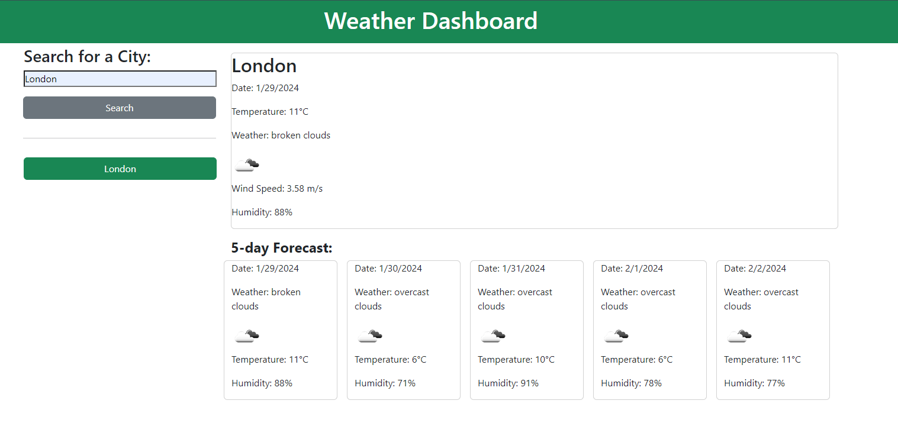
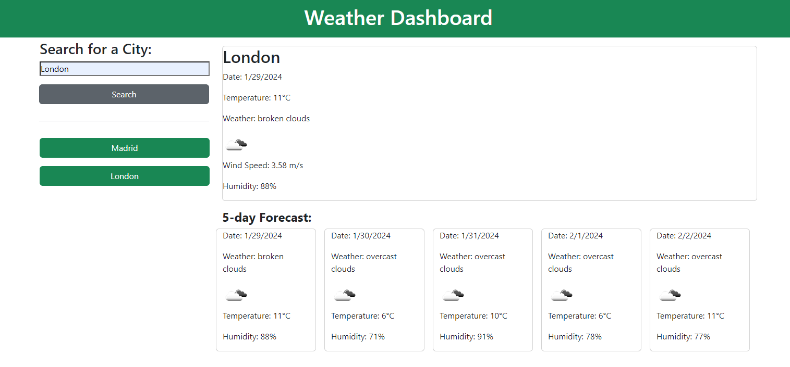

# Weather Application

## Description

This is a simple web application that allows users to check the current weather and a 5-day forecast for a specific city. Users can input the desired city, and the application fetches real-time weather data from the OpenWeatherMap API.

## Features

* Current Weather: Retrieve information about the current temperature, weather conditions, wind speed, and humidity for a chosen city.

* 5-Day Forecast: View a 5-day weather forecast to plan ahead.

* Search History: Keep track of previously searched cities with a search history feature.

https://eesahbella.github.io/weather-dashboard/

## APIs Used

OpenWeatherMap API: The application uses the OpenWeatherMap API to fetch weather data for the specified city.

## References

* HTML, CSS, and JavaScript All-In-One for Dummies (McFedries, P. (2023) ‘4 Building Dynamic Pages with JavaScript’, in HTML, CSS, & javascript: All-in-one. Hoboken, NJ: John Wiley & Sons, Inc. )
* https://www.w3schools.com/
* https://www.freecodecamp.org/
* https://developer.mozilla.org/
* Xpert Learning Assistant

